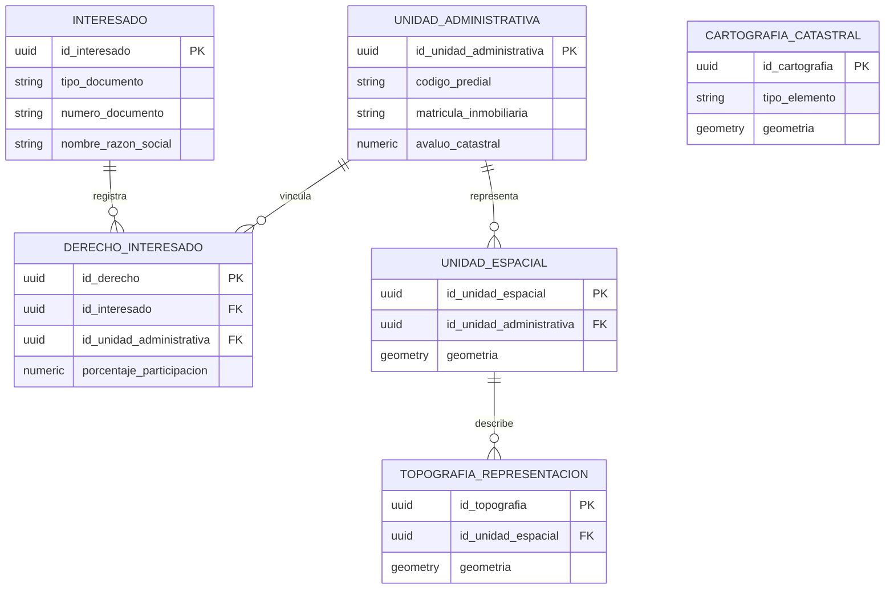

# Modelo de datos implementado

El proyecto implementa una version academica y simplificada de entidades
relacionadas con el enfoque LADM_COL SINIC V1.0.

## Entidades

- **Interesado:** persona natural o juridica relacionada con el predio.
- **Unidad Administrativa:** informacion administrativa, economica y de vigencia
  del predio.
- **Derecho Interesado:** asociacion entre interesado, unidad administrativa y
  tipo de derecho.
- **Unidad Espacial:** geometria predial o unidad territorial en EPSG:9377.
- **Topografia y Representacion:** elementos espaciales obtenidos de captura o
  representacion cartografica.
- **Cartografia Catastral:** capas de apoyo como manzanas, vias, sectores o
  veredas.
